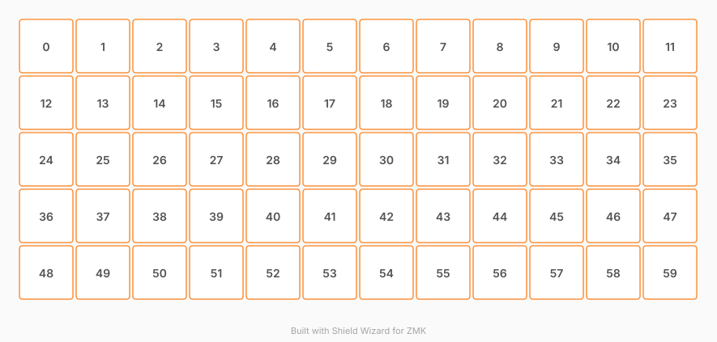

# ZMK Configuration for preonic

*Generated by Shield Wizard for ZMK*



Download compiled firmware from the Actions tab. <https://zmk.dev/docs/user-setup#installing-the-firmware>

Edit your keymap <https://zmk.dev/docs/keymaps>.
User keymap is located at [`config/preonic.keymap`](config/preonic.keymap).

-----

<details>
<summary>
Shield Wizard Debug Information
</summary>

In case of broken configuration, here is the Shield Wizard internal data used to generate this configuration:

Commit: ab99418c376887d043556e4a1af5a8d1c78d686c

```json
{"name":"preonic","shield":"preonic","dongle":false,"modules":[],"layout":[{"id":"01M16SC87PNV6VEH6ZY3E00Q5A","part":0,"row":0,"col":0,"w":1,"h":1,"x":0,"y":0,"r":0,"rx":0,"ry":0},{"id":"01M16SC87PNRYPN3PEBBMCKBKW","part":0,"row":0,"col":1,"w":1,"h":1,"x":1,"y":0,"r":0,"rx":0,"ry":0},{"id":"01M16SC87PG8H74VVWSPV1Q4P1","part":0,"row":0,"col":2,"w":1,"h":1,"x":2,"y":0,"r":0,"rx":0,"ry":0},{"id":"01M16SC87PEGCENW03YSS15C1C","part":0,"row":0,"col":3,"w":1,"h":1,"x":3,"y":0,"r":0,"rx":0,"ry":0},{"id":"01M16SC87PW6ESZX8HTGAJQYM6","part":0,"row":0,"col":4,"w":1,"h":1,"x":4,"y":0,"r":0,"rx":0,"ry":0},{"id":"01M16SC87PJTVAQ2DJMG5QGKQ5","part":0,"row":0,"col":5,"w":1,"h":1,"x":5,"y":0,"r":0,"rx":0,"ry":0},{"id":"01M16SC87P3CBFZ3Y1S6VSNKMK","part":0,"row":0,"col":6,"w":1,"h":1,"x":6,"y":0,"r":0,"rx":0,"ry":0},{"id":"01M16SC87PB7B3XTPXGCN069E0","part":0,"row":0,"col":7,"w":1,"h":1,"x":7,"y":0,"r":0,"rx":0,"ry":0},{"id":"01M16SC87PS9CD8MT4B58PY3CJ","part":0,"row":0,"col":8,"w":1,"h":1,"x":8,"y":0,"r":0,"rx":0,"ry":0},{"id":"01M16SC87PYTYMV2EECKE1RC6H","part":0,"row":0,"col":9,"w":1,"h":1,"x":9,"y":0,"r":0,"rx":0,"ry":0},{"id":"01M16SC87P9NC301BTEEWSCDWA","part":0,"row":0,"col":10,"w":1,"h":1,"x":10,"y":0,"r":0,"rx":0,"ry":0},{"id":"01M16SC87PMF188XQHQY434QH0","part":0,"row":0,"col":11,"w":1,"h":1,"x":11,"y":0,"r":0,"rx":0,"ry":0},{"id":"01M16SC87P8SYRQ2SH6JN7HNKM","part":0,"row":1,"col":0,"w":1,"h":1,"x":0,"y":1,"r":0,"rx":0,"ry":0},{"id":"01M16SC87PSRY1EN88KY4HREED","part":0,"row":1,"col":1,"w":1,"h":1,"x":1,"y":1,"r":0,"rx":0,"ry":0},{"id":"01M16SC87PS6JMTDYHKJPDNEAJ","part":0,"row":1,"col":2,"w":1,"h":1,"x":2,"y":1,"r":0,"rx":0,"ry":0},{"id":"01M16SC87P5QJVB8HZ3EJQ8VJP","part":0,"row":1,"col":3,"w":1,"h":1,"x":3,"y":1,"r":0,"rx":0,"ry":0},{"id":"01M16SC87PN9NFS7DF622CDZAF","part":0,"row":1,"col":4,"w":1,"h":1,"x":4,"y":1,"r":0,"rx":0,"ry":0},{"id":"01M16SC87PE22AM0SYFX0M5B0V","part":0,"row":1,"col":5,"w":1,"h":1,"x":5,"y":1,"r":0,"rx":0,"ry":0},{"id":"01M16SC87P5H3V3YQFBM2SAPQX","part":0,"row":1,"col":6,"w":1,"h":1,"x":6,"y":1,"r":0,"rx":0,"ry":0},{"id":"01M16SC87P7AZG8CJ10C161FZC","part":0,"row":1,"col":7,"w":1,"h":1,"x":7,"y":1,"r":0,"rx":0,"ry":0},{"id":"01M16SC87P08YCZ0S5NM67Q83Y","part":0,"row":1,"col":8,"w":1,"h":1,"x":8,"y":1,"r":0,"rx":0,"ry":0},{"id":"01M16SC87P6FET5EBSPJ5VBZY7","part":0,"row":1,"col":9,"w":1,"h":1,"x":9,"y":1,"r":0,"rx":0,"ry":0},{"id":"01M16SC87P205RFT3K1KH9WF2F","part":0,"row":1,"col":10,"w":1,"h":1,"x":10,"y":1,"r":0,"rx":0,"ry":0},{"id":"01M16SC87PCGTYWWGQJPG02W26","part":0,"row":1,"col":11,"w":1,"h":1,"x":11,"y":1,"r":0,"rx":0,"ry":0},{"id":"01M16SC87PAPRN360Z6QV47Z37","part":0,"row":2,"col":0,"w":1,"h":1,"x":0,"y":2,"r":0,"rx":0,"ry":0},{"id":"01M16SC87PMWJH6FRPPGZFRX1X","part":0,"row":2,"col":1,"w":1,"h":1,"x":1,"y":2,"r":0,"rx":0,"ry":0},{"id":"01M16SC87P90SE8D2DTZJAWDVA","part":0,"row":2,"col":2,"w":1,"h":1,"x":2,"y":2,"r":0,"rx":0,"ry":0},{"id":"01M16SC87P9VZXB1EEENYYFCAZ","part":0,"row":2,"col":3,"w":1,"h":1,"x":3,"y":2,"r":0,"rx":0,"ry":0},{"id":"01M16SC87PVWTC9YQV1A9ZVH09","part":0,"row":2,"col":4,"w":1,"h":1,"x":4,"y":2,"r":0,"rx":0,"ry":0},{"id":"01M16SC87PME2BN3QS54P8W6TE","part":0,"row":2,"col":5,"w":1,"h":1,"x":5,"y":2,"r":0,"rx":0,"ry":0},{"id":"01M16SC87PEC18WQGYG9DSNZS7","part":0,"row":2,"col":6,"w":1,"h":1,"x":6,"y":2,"r":0,"rx":0,"ry":0},{"id":"01M16SC87P8WWMZ4M3WXN13B1G","part":0,"row":2,"col":7,"w":1,"h":1,"x":7,"y":2,"r":0,"rx":0,"ry":0},{"id":"01M16SC87PY12JQD1754J4BZN5","part":0,"row":2,"col":8,"w":1,"h":1,"x":8,"y":2,"r":0,"rx":0,"ry":0},{"id":"01M16SC87PEKKCWQERR30AJ1BK","part":0,"row":2,"col":9,"w":1,"h":1,"x":9,"y":2,"r":0,"rx":0,"ry":0},{"id":"01M16SC87PBBWB6FH09T2YV3WZ","part":0,"row":2,"col":10,"w":1,"h":1,"x":10,"y":2,"r":0,"rx":0,"ry":0},{"id":"01M16SC87P9PSAM192B7CPSKQV","part":0,"row":2,"col":11,"w":1,"h":1,"x":11,"y":2,"r":0,"rx":0,"ry":0},{"id":"01M16SC87P8ZB4WY7V191CFPTM","part":0,"row":3,"col":0,"w":1,"h":1,"x":0,"y":3,"r":0,"rx":0,"ry":0},{"id":"01M16SC87PZZXGK4Z208R3W2YJ","part":0,"row":3,"col":1,"w":1,"h":1,"x":1,"y":3,"r":0,"rx":0,"ry":0},{"id":"01M16SC87PZ2QV17WJE22Z1YPW","part":0,"row":3,"col":2,"w":1,"h":1,"x":2,"y":3,"r":0,"rx":0,"ry":0},{"id":"01M16SC87PYQV0TKEP0A6PZCRB","part":0,"row":3,"col":3,"w":1,"h":1,"x":3,"y":3,"r":0,"rx":0,"ry":0},{"id":"01M16SC87PTXGW5TADTZWJPAQH","part":0,"row":3,"col":4,"w":1,"h":1,"x":4,"y":3,"r":0,"rx":0,"ry":0},{"id":"01M16SC87PNGDDDV9TQ28GTKCM","part":0,"row":3,"col":5,"w":1,"h":1,"x":5,"y":3,"r":0,"rx":0,"ry":0},{"id":"01M16SC87PVWYTGM6AN6GSSZMV","part":0,"row":3,"col":6,"w":1,"h":1,"x":6,"y":3,"r":0,"rx":0,"ry":0},{"id":"01M16SC87PDWPHVXQTJJ05AMFA","part":0,"row":3,"col":7,"w":1,"h":1,"x":7,"y":3,"r":0,"rx":0,"ry":0},{"id":"01M16SC87PVW7TH9QVZJ06KJWQ","part":0,"row":3,"col":8,"w":1,"h":1,"x":8,"y":3,"r":0,"rx":0,"ry":0},{"id":"01M16SC87P46HXGDR2BJX6KJQR","part":0,"row":3,"col":9,"w":1,"h":1,"x":9,"y":3,"r":0,"rx":0,"ry":0},{"id":"01M16SC87P11Q2KNNNBNQ65CCB","part":0,"row":3,"col":10,"w":1,"h":1,"x":10,"y":3,"r":0,"rx":0,"ry":0},{"id":"01M16SC87PDYPVFE1SBS61YH52","part":0,"row":3,"col":11,"w":1,"h":1,"x":11,"y":3,"r":0,"rx":0,"ry":0},{"id":"01M16SC87PFDY082VFHRVNE1HQ","part":0,"row":4,"col":0,"w":1,"h":1,"x":0,"y":4,"r":0,"rx":0,"ry":0},{"id":"01M16SC87PBYWCJZJC7PXS5P14","part":0,"row":4,"col":1,"w":1,"h":1,"x":1,"y":4,"r":0,"rx":0,"ry":0},{"id":"01M16SC87PS26QYQKABV4S283M","part":0,"row":4,"col":2,"w":1,"h":1,"x":2,"y":4,"r":0,"rx":0,"ry":0},{"id":"01M16SC87PNH5188R8TS8N6W5T","part":0,"row":4,"col":3,"w":1,"h":1,"x":3,"y":4,"r":0,"rx":0,"ry":0},{"id":"01M16SC87P0ZW7QQRVH5TP08S0","part":0,"row":4,"col":4,"w":1,"h":1,"x":4,"y":4,"r":0,"rx":0,"ry":0},{"id":"01M16SC87PDGZVXYST3BT8KX7M","part":0,"row":4,"col":5,"w":1,"h":1,"x":5,"y":4,"r":0,"rx":0,"ry":0},{"id":"01M16SC87P3TJKK8NK4FVY55CF","part":0,"row":4,"col":6,"w":1,"h":1,"x":6,"y":4,"r":0,"rx":0,"ry":0},{"id":"01M16SC87PJYCKP7813HT7FP48","part":0,"row":4,"col":7,"w":1,"h":1,"x":7,"y":4,"r":0,"rx":0,"ry":0},{"id":"01M16SC87PA593RYSZR39817CF","part":0,"row":4,"col":8,"w":1,"h":1,"x":8,"y":4,"r":0,"rx":0,"ry":0},{"id":"01M16SC87P6ZZ73E90AS488WZM","part":0,"row":4,"col":9,"w":1,"h":1,"x":9,"y":4,"r":0,"rx":0,"ry":0},{"id":"01M16SC87P4E85TMKNWYA0GSSR","part":0,"row":4,"col":10,"w":1,"h":1,"x":10,"y":4,"r":0,"rx":0,"ry":0},{"id":"01M16SC87PBH655VSS19MJMZS3","part":0,"row":4,"col":11,"w":1,"h":1,"x":11,"y":4,"r":0,"rx":0,"ry":0}],"parts":[{"name":"unibody","controller":"nice_nano_v2","pins":{"d0":{"usage":"kscan","kscan":"01M16SD00MG1TP1ENW6PQNXKY5","role":"output"},"d1":{"usage":"kscan","kscan":"01M16SD00MG1TP1ENW6PQNXKY5","role":"output"},"d2":{"usage":"kscan","kscan":"01M16SD00MG1TP1ENW6PQNXKY5","role":"output"},"d3":{"usage":"kscan","kscan":"01M16SD00MG1TP1ENW6PQNXKY5","role":"output"},"d4":{"usage":"kscan","kscan":"01M16SD00MG1TP1ENW6PQNXKY5","role":"output"},"d5":{"usage":"kscan","kscan":"01M16SD00MG1TP1ENW6PQNXKY5","role":"output"},"d6":{"usage":"kscan","kscan":"01M16SD00MG1TP1ENW6PQNXKY5","role":"output"},"d7":{"usage":"kscan","kscan":"01M16SD00MG1TP1ENW6PQNXKY5","role":"output"},"d8":{"usage":"kscan","kscan":"01M16SD00MG1TP1ENW6PQNXKY5","role":"output"},"d9":{"usage":"kscan","kscan":"01M16SD00MG1TP1ENW6PQNXKY5","role":"output"},"d10":{"usage":"kscan","kscan":"01M16SD00MG1TP1ENW6PQNXKY5","role":"output"},"d16":{"usage":"kscan","kscan":"01M16SD00MG1TP1ENW6PQNXKY5","role":"output"},"d14":{"usage":"kscan","kscan":"01M16SD00MG1TP1ENW6PQNXKY5","role":"input"},"d15":{"usage":"kscan","kscan":"01M16SD00MG1TP1ENW6PQNXKY5","role":"input"},"d18":{"usage":"kscan","kscan":"01M16SD00MG1TP1ENW6PQNXKY5","role":"input"},"d19":{"usage":"kscan","kscan":"01M16SD00MG1TP1ENW6PQNXKY5","role":"input"},"d20":{"usage":"kscan","kscan":"01M16SD00MG1TP1ENW6PQNXKY5","role":"input"}},"kscans":[{"kind":"matrix","id":"01M16SD00MG1TP1ENW6PQNXKY5","diodes":true}],"keys":{"01M16SC87PNV6VEH6ZY3E00Q5A":{"input":"d14","output":"d0"},"01M16SC87PNRYPN3PEBBMCKBKW":{"input":"d14","output":"d1"},"01M16SC87PG8H74VVWSPV1Q4P1":{"input":"d14","output":"d2"},"01M16SC87PEGCENW03YSS15C1C":{"input":"d14","output":"d3"},"01M16SC87PW6ESZX8HTGAJQYM6":{"input":"d14","output":"d4"},"01M16SC87PJTVAQ2DJMG5QGKQ5":{"input":"d14","output":"d5"},"01M16SC87P3CBFZ3Y1S6VSNKMK":{"input":"d14","output":"d6"},"01M16SC87PB7B3XTPXGCN069E0":{"input":"d14","output":"d7"},"01M16SC87PS9CD8MT4B58PY3CJ":{"input":"d14","output":"d8"},"01M16SC87PYTYMV2EECKE1RC6H":{"input":"d14","output":"d9"},"01M16SC87P9NC301BTEEWSCDWA":{"input":"d14","output":"d10"},"01M16SC87P205RFT3K1KH9WF2F":{"input":"d15","output":"d10"},"01M16SC87PMF188XQHQY434QH0":{"input":"d14","output":"d16"},"01M16SC87P8SYRQ2SH6JN7HNKM":{"input":"d15","output":"d0"},"01M16SC87PSRY1EN88KY4HREED":{"input":"d15","output":"d1"},"01M16SC87PS6JMTDYHKJPDNEAJ":{"input":"d15","output":"d2"},"01M16SC87P5QJVB8HZ3EJQ8VJP":{"input":"d15","output":"d3"},"01M16SC87PN9NFS7DF622CDZAF":{"input":"d15","output":"d4"},"01M16SC87PE22AM0SYFX0M5B0V":{"input":"d15","output":"d5"},"01M16SC87P5H3V3YQFBM2SAPQX":{"input":"d15","output":"d6"},"01M16SC87P7AZG8CJ10C161FZC":{"input":"d15","output":"d7"},"01M16SC87P08YCZ0S5NM67Q83Y":{"input":"d15","output":"d8"},"01M16SC87P6FET5EBSPJ5VBZY7":{"input":"d15","output":"d9"},"01M16SC87PCGTYWWGQJPG02W26":{"input":"d15","output":"d16"},"01M16SC87PAPRN360Z6QV47Z37":{"input":"d18","output":"d0"},"01M16SC87P8ZB4WY7V191CFPTM":{"input":"d19","output":"d0"},"01M16SC87PFDY082VFHRVNE1HQ":{"input":"d20","output":"d0"},"01M16SC87PMWJH6FRPPGZFRX1X":{"input":"d18","output":"d1"},"01M16SC87PZZXGK4Z208R3W2YJ":{"input":"d19","output":"d1"},"01M16SC87PBYWCJZJC7PXS5P14":{"input":"d20","output":"d1"},"01M16SC87P90SE8D2DTZJAWDVA":{"input":"d18","output":"d2"},"01M16SC87PZ2QV17WJE22Z1YPW":{"input":"d19","output":"d2"},"01M16SC87PS26QYQKABV4S283M":{"input":"d20","output":"d2"},"01M16SC87P9VZXB1EEENYYFCAZ":{"input":"d18","output":"d3"},"01M16SC87PYQV0TKEP0A6PZCRB":{"input":"d19","output":"d3"},"01M16SC87PNH5188R8TS8N6W5T":{"input":"d20","output":"d3"},"01M16SC87PVWTC9YQV1A9ZVH09":{"input":"d18","output":"d4"},"01M16SC87PTXGW5TADTZWJPAQH":{"input":"d19","output":"d4"},"01M16SC87P0ZW7QQRVH5TP08S0":{"input":"d20","output":"d4"},"01M16SC87PME2BN3QS54P8W6TE":{"input":"d18","output":"d5"},"01M16SC87PNGDDDV9TQ28GTKCM":{"input":"d19","output":"d5"},"01M16SC87PDGZVXYST3BT8KX7M":{"input":"d20","output":"d5"},"01M16SC87PEC18WQGYG9DSNZS7":{"input":"d18","output":"d6"},"01M16SC87PVWYTGM6AN6GSSZMV":{"input":"d19","output":"d6"},"01M16SC87P3TJKK8NK4FVY55CF":{"input":"d20","output":"d6"},"01M16SC87P8WWMZ4M3WXN13B1G":{"input":"d18","output":"d7"},"01M16SC87PDWPHVXQTJJ05AMFA":{"input":"d19","output":"d7"},"01M16SC87PJYCKP7813HT7FP48":{"input":"d20","output":"d7"},"01M16SC87PY12JQD1754J4BZN5":{"input":"d18","output":"d8"},"01M16SC87PVW7TH9QVZJ06KJWQ":{"input":"d19","output":"d8"},"01M16SC87PA593RYSZR39817CF":{"input":"d20","output":"d8"},"01M16SC87PEKKCWQERR30AJ1BK":{"input":"d18","output":"d9"},"01M16SC87P46HXGDR2BJX6KJQR":{"input":"d19","output":"d9"},"01M16SC87P6ZZ73E90AS488WZM":{"input":"d20","output":"d9"},"01M16SC87PBBWB6FH09T2YV3WZ":{"input":"d18","output":"d10"},"01M16SC87P11Q2KNNNBNQ65CCB":{"input":"d19","output":"d10"},"01M16SC87P4E85TMKNWYA0GSSR":{"input":"d20","output":"d10"},"01M16SC87P9PSAM192B7CPSKQV":{"input":"d18","output":"d16"},"01M16SC87PDYPVFE1SBS61YH52":{"input":"d19","output":"d16"},"01M16SC87PBH655VSS19MJMZS3":{"input":"d20","output":"d16"}},"encoders":[],"buses":{}}]}
```

</details>
